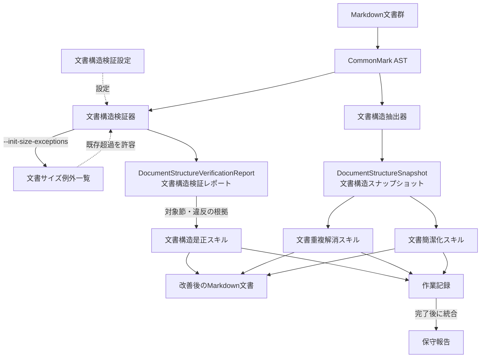

# verify-docs

Markdown文書群の検査・改善パッケージ。[文書構造検証器](docs/structure.md#文書構造検証器)・
[文書構造抽出器](docs/structure.md#文書構造抽出器)と3つのスキルを同梱する。
CommonMark ASTを基盤に、参照整合性・文書構造・サイズ・重複を検査し、
文書構造の是正、意味的重複の解消、意味を保った簡潔化を支援する。

## 導入

実行にはNode.js 22.23.2を使う。本リポジトリ自身のCIもルートの`.nvmrc`でこの版に
固定している。

対象リポジトリのルートで次の一行を実行する。

```bash
curl -fsSL https://raw.githubusercontent.com/MichinaoShimizu/claude-kit/main/packages/verify-docs/install.sh | bash
```

## 実行方法

### スキルの実行

各エージェントで以下を実行する。

| エージェント | 実行方法 |
| --- | --- |
| Claude Code | `/verify-docs`・`/dedupe-docs`・`/tighten-docs` |
| Kiro | `/verify-docs`・`/dedupe-docs`・`/tighten-docs` |
| Codex App | `@verify-docs`・`@dedupe-docs`・`@tighten-docs` |
| Codex CLI／IDE拡張 | `$verify-docs`・`$dedupe-docs`・`$tighten-docs` |

3つを順番に実行する場合は、どのエージェントでも次の共通依頼を使う。

> 文書構造是正スキル・文書重複解消スキル・文書簡潔化スキルを順番に全部実行して

CLIの詳細は[CLIリファレンス](docs/advanced-usage.md)を参照。

## 生成物と標準出力

### 改善後のMarkdown文書

スキルが対象文書を改善し、変更をリポジトリ内のMarkdown文書に反映する。

### [保守報告](.agents/skills/verify-docs/references/work-records-and-report.md#保守報告)

スキル別の一時記録を `.verify-docs/dist/` に置き、完了後に保守報告へ統合する。形式は
[作業記録と保守報告](.agents/skills/verify-docs/references/work-records-and-report.md)を参照。

作業単位の継続・切替は
[導入と運用「保守報告の作業単位」](docs/adoption.md#保守報告の作業単位)
を参照。

契約テストの範囲は[構造解析と機械検査](docs/structure.md#スキルの契約テスト)を参照。

### 検査結果（標準出力）

標準出力には検査概要、大きい末端節の上位5件、文書サイズ例外を表示する。違反の詳細は標準エラーに出力する。

### 検査結果（JSON）

`node scripts/document-structure-verifier.mjs --json`は、DocumentStructureVerificationReport（文書構造検証レポート）を標準出力する。項目と例は
[CLIリファレンス「文書構造検証レポートのJSON出力」](docs/advanced-usage.md#文書構造検証レポートのjson出力)を参照。

## 機能と責務

| 機能 | 課題 | 内容 | 対象外 |
| --- | --- | --- | --- |
| [文書構造検証器](docs/structure.md#文書構造検証器) | リンク切れ、孤立文書、サイズ超過、同一段落 | CommonMark ASTで構造違反を検出 | 意味の近さや文章の良し悪しの判断 |
| [文書構造是正スキル](.agents/skills/verify-docs/SKILL.md#文書構造是正スキル) | 検出した構造違反 | 文書の置き場所と参照関係を整える | 内容の要約・言い換え・文章の推敲 |
| [文書重複解消スキル](.agents/skills/dedupe-docs/SKILL.md#文書重複解消スキル) | 言い換えた同じ説明 | 意味的重複を正本へ集約し、他方を案内にする | 文脈や読者が異なる説明の強制統合 |
| [文書簡潔化スキル](.agents/skills/tighten-docs/SKILL.md#文書簡潔化スキル) | 冗長な文章 | 意味を保った冗長表現を削る | 文書の分割、重複の集約、意味の変更 |
| [文書構造抽出器](docs/structure.md#文書構造抽出器) | 文書構造の確認・記録 | DocumentStructureSnapshot（文書構造スナップショット）をJSON出力 | 意味的な重複や冗長性の自動判定 |

## 処理構成



## 設定ファイル

既定の設定で足りる場合、設定ファイルは不要。対象リポジトリで検査の動作を変えるときは、
ルートに[文書構造検証設定](.agents/skills/verify-docs/references/config.md#文書構造検証設定)を作り、変更する項目だけを指定する。
設定項目と入力制約は同設定の説明を参照。

## 関連文書

- [既存リポジトリへの導入、CI、文書サイズ例外の運用](docs/adoption.md)
- [CommonMark ASTによる構造解析と機械検査](docs/structure.md)
- [導入・検査・CI の運用オブジェクト](docs/operations.md)
- [エージェント間の互換構成](.agents/skills/verify-docs/references/agent-compatibility.md)
- [文書構造検証設定](.agents/skills/verify-docs/references/config.md#文書構造検証設定)
- [オブジェクトの名称・参照規約](.agents/skills/verify-docs/references/object-naming.md)
- [文書サイズ例外一覧の形式](.agents/skills/verify-docs/references/document-size-exceptions.md)
- [検出事項の是正手順](.agents/skills/verify-docs/SKILL.md)
- [この一式の改修作法](CONTRIBUTING.md)

Markdown構文解析にはCommonMark.js 0.31.2を同梱しているため、
導入先で追加のnpmインストールは不要。ライセンスは
`scripts/vendor/commonmark-LICENSE.txt`を参照。
