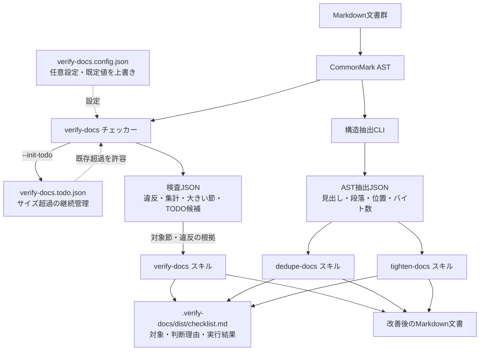

# verify-docs

Markdown文書群の検査・改善パッケージ。チェッカーと構造抽出CLIに加え、
`verify-docs`・`dedupe-docs`・`tighten-docs`の3つのスキルを同梱する。
CommonMark ASTを基盤に、参照整合性・文書構造・サイズ・重複を検査し、
文書構造の是正、意味的重複の解消、意味を保った簡潔化を支援する。

## 導入

対象リポジトリのルートで次の一行を実行する。

```bash
curl -fsSL https://raw.githubusercontent.com/MichinaoShimizu/claude-kit/main/verify-docs/install.sh | bash
```

## 実行

### スキルの実行

各エージェントで以下を実行する。

| エージェント | 実行方法 |
| --- | --- |
| Claude Code | `/verify-docs`・`/dedupe-docs`・`/tighten-docs` |
| Kiro | `/verify-docs`・`/dedupe-docs`・`/tighten-docs` |
| Codex | `$verify-docs`・`$dedupe-docs`・`$tighten-docs` |

3つを順番に実行する場合は、どのエージェントでも次の共通依頼を使う。

> verify-docs・dedupe-docs・tighten-docsを順番に全部実行して

CLIを使うその他の操作は[高度な使い方](docs/advanced-usage.md)を参照。

## 出力

### 改善後のMarkdown文書

スキルが対象文書を改善し、変更をリポジトリ内のMarkdown文書に反映する。

### チェックリスト

スキルは対象文書・判断理由・実行結果を`.verify-docs/dist/checklist.md`に記録する
（[チェックリストの形式](.agents/skills/verify-docs/references/checklist.md)）。
3スキルを連続実行した回だけ、統合した完了レコードも記録する。
チェッカーコマンド単独ではチェックリストを作成しない。

### 契約テスト

`dedupe-docs`・`tighten-docs`の意味判断そのものはCIで自動判定しない。代わりに
自己検査ではfixtureを使い、共通チェッカーの通過、正本へのポインタ化、必須情報の保持、
サイズ変化と実行結果のチェックリスト記録を契約として検証する。意味的な重複や文章品質の
最終判断は、人またはエージェントのレビューで継続して評価する。

### 検査結果（標準出力）

標準出力には検査概要とサイズの大きい末端節の上位5件を表示する。TODO登録があれば、
対象文書と分割候補節も表示する。違反の詳細は標準エラーに出力する。通常の検査では
Markdown文書やチェックリストを変更しない。

### 検査結果（JSON）

`node scripts/verify-docs.mjs --json`のように実行すると、文書数・構造集計、違反種別ごとの件数、
大きな節、TODO候補（[TODOファイルの記述形式](.agents/skills/verify-docs/references/todo.md)）に加え、
違反箇所の行・列・見出し階層や重複箇所をJSON形式で標準出力に出力する。詳しい例は
[高度な使い方「検査結果をJSONで取得する」](docs/advanced-usage.md#検査結果をjsonで取得する)を参照。

## 機能

| 機能 | 課題 | 内容 | 対象外 |
| --- | --- | --- | --- |
| [チェッカー](docs/advanced-usage.md#文書構造を検査する) | リンク切れ、孤立文書、サイズ超過、同一段落 | CommonMark ASTで構造違反を検出 | 意味の近さや文章の良し悪しの判断 |
| [`verify-docs` スキル](.agents/skills/verify-docs/SKILL.md) | 検出した構造違反 | 文書の置き場所と参照関係を整える | 内容の要約・言い換え・文章の推敲 |
| [`dedupe-docs` スキル](.agents/skills/dedupe-docs/SKILL.md) | 言い換えた同じ説明 | 意味的重複を正本へ集約し、他方を案内にする | 文脈や読者が異なる説明の強制統合 |
| [`tighten-docs` スキル](.agents/skills/tighten-docs/SKILL.md) | 冗長な文章 | 意味を保った冗長表現を削る | 文書の分割、重複の集約、意味の変更 |
| [構造抽出CLI](docs/advanced-usage.md#ast情報をjsonで取得する) | 文書構造の確認・記録 | 見出し・段落・位置・バイト数をJSON出力 | 意味的な重複や冗長性の自動判定 |

## 構造



## 設定

既定の設定で足りる場合、設定ファイルは不要。対象リポジトリで検査の動作を変えるときは、
ルートに`verify-docs.config.json`を作り、変更する項目だけを指定する。
設定項目と入力制約は[設定ファイルの説明](.agents/skills/verify-docs/references/config.md)を参照。

## 参考

- [既存リポジトリへの導入、CI、TODOの運用](docs/adoption.md)
- [CommonMark ASTによる構造解析と機械検査](docs/structure.md)
- [エージェント間の互換構成](.agents/skills/verify-docs/references/agent-compatibility.md)
- [設定項目](.agents/skills/verify-docs/references/config.md)
- [TODOファイルの記述形式](.agents/skills/verify-docs/references/todo.md)
- [検出事項の是正手順](.agents/skills/verify-docs/SKILL.md)
- [この一式の改修作法](CONTRIBUTING.md)

Markdown構文解析にはCommonMark.js 0.31.2を同梱しているため、
導入先で追加のnpmインストールは不要。ライセンスは
`scripts/vendor/commonmark-LICENSE.txt`を参照。
